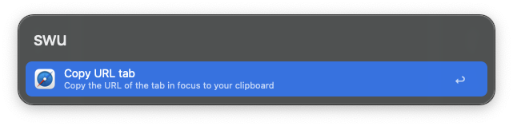
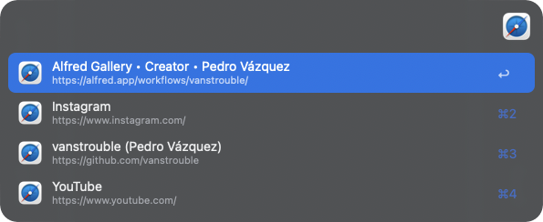
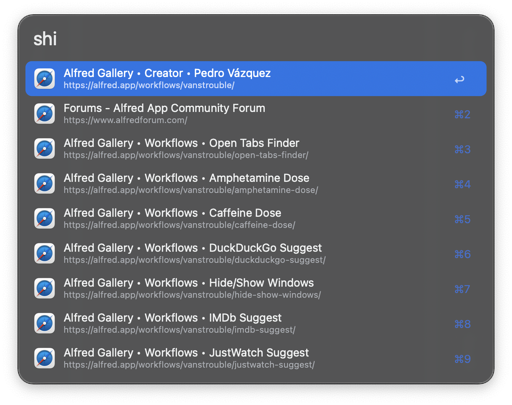
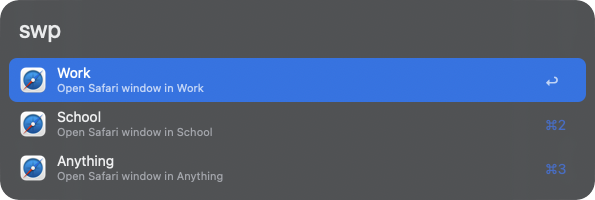

#  Safari Control | Alfred Workflow

Open Safari windows from anywhere, jump into private browsing, switch between profiles, browse your history, and move through tabs instantly, right from Alfred.

## Download

- Available on the Alfred Gallery. [Get it here](https://alfred.app/workflows/vanstrouble/safari-control/).
- You can also download it directly [from GitHub here](https://github.com/vanstrouble/new-safari-window-alfred-workflow/releases/latest).

## Usage

### New window (sw)

Opens a new Safari window in the current space.

- **Keyword:** `sw`
  - `⌘` `↩` Open a new private window

#### Examples:

| Command         | Description                                                                 |
|-----------------|-----------------------------------------------------------------------------|
| `sw`            | Opens a new Safari window in the current space.                            |
| `sw x3`         | Opens 3 new Safari windows in the current space.                           |
| `sw URL`        | Opens a new Safari window with the specified URL.                          |
| `sw + Command (⌘)`  | Opens a new tab in the current Safari window instead of creating a window. |

### Copy current tab URL (swu)

Copies the URL of the currently focused Safari tab directly to your clipboard, allowing for quick sharing or referencing.

- **Keyword:** `swu`
  - `⇧` `⌘` Copy the URL using Markdown format.

### Open current tab in private mode (stp)

Extracts the current tab (the one you are currently viewing) and opens it in a new private browsing window.

- **Keyword:** `stp`
  - `⌘` `↩` Close the tab in the normal browsing windows.

### List Safari tabs (swt)

Browse all open Safari tabs and search by title or URL to instantly bring the one you need into focus.

- **Keyword:** `swt`
  - `⌘` `↩` Copy the URL of the tab
  - `⇧` `⌘` Copy the URL using Markdown format.
  - `⌃` `↩` Close the tab
  - `⌥` `↩` Modify the URL

### List Safari history (shi)

Browse your recent Safari browsing history and search by title or URL.

- **Keyword:** `shi`
  - `↩` Open the selected history item in Safari
  - `⌘` `↩` Copy the URL to the clipboard
  - `⇧` `⌘` Copy the URL using Markdown format.
  - `⌥` `↩` Modify the URL

### Open Safari window profiles (swp)

List and open Safari windows using up to 5 customizable profiles (e.g., work, personal, school).

- **Keyword:** `swp`

Use `sw p[number]` to instantly open a new Safari window with the selected profile.

#### Examples:

| Command         | Description                                                                 |
|-----------------|-----------------------------------------------------------------------------|
| `swp`           | Lists available profiles (Profile 1, …, Profile 5).                |
| `sw p1`        | Opens a new Safari window using Profile 1.                                 |
| `sw p2`        | Opens a new Safari window using Profile 2.                                 |
| `sw p3`        | Opens a new Safari window using Profile 3.                                 |

**Note:** Profiles without assigned names in the workflow configuration will not appear in the list, allowing for a cleaner interface with only the profiles that are actually used.

## Customization

Keywords, hotkeys, and Safari profile names can be customized. All configuration is handled directly in Alfred.

## Acknowledgments

- This workflow is inspired in [Caio Gondim's one](https://github.com/caiogondim/alfred-chrome-window-workflow?tab=readme-ov-file)
