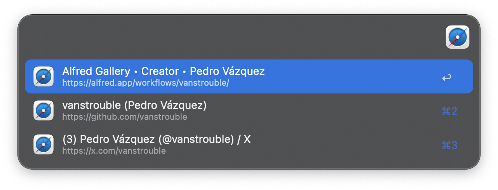
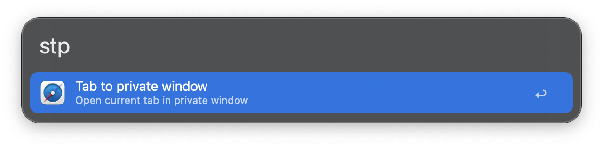

#  Safari Control | Alfred Workflow

A powerful Alfred workflow to manage Safari efficiently. Safari Control allows you to create new windows, open private browsing sessions, switch between profiles, and quickly navigate through your open tabs—all without leaving Alfred.

## Install

- Get the latest release on GitHub [here](https://github.com/vanstrouble/new-safari-window-alfred-workflow/releases).

**This workflow is only for Alfred.app Powerpack users.**

## Getting Started

### New window (sw)

Opens a new Safari window in the current space. By default, pressing the **Command** key will open a **new private window**.

#### Examples:

| Command         | Description                                                                 |
|-----------------|-----------------------------------------------------------------------------|
| `sw`            | Opens a new Safari window in the current space.                            |
| `sw x3`         | Opens 3 new Safari windows in the current space.                           |
| `sw URL`        | Opens a new Safari window with the specified URL.                          |
| `sw + Command (⌘)`  | Opens a new tab in the current Safari window instead of creating a window. |

### Open Safari window profiles (swp)

This command allows you to list and open Safari windows using specific profiles. Safari supports multiple profiles, which can be used to separate browsing contexts (e.g., work, personal, testing). The workflow supports up to 3 profiles, which can be customized.

You can also directly use commands like `sw p1`, `sw p2`, or `sw p3` to open a new Safari window with the selected profile without listing them first.

#### Examples:

| Command         | Description                                                                 |
|-----------------|-----------------------------------------------------------------------------|
| `swp`           | Lists available profiles (Profile 1, Profile 2, Profile 3).                |
| `sw p1`        | Opens a new Safari window using Profile 1.                                 |
| `sw p2`        | Opens a new Safari window using Profile 2.                                 |
| `sw p3`        | Opens a new Safari window using Profile 3.                                 |

### List Safari tabs (swt)

This command lists all open tabs across all Safari windows. You can quickly search for a specific tab by its title or URL and select it to bring it into focus.

#### Notes:
- Selecting a tab from the list will immediately focus on the corresponding Safari window and tab.
- The search functionality allows you to find tabs quickly, even if you have many open across multiple windows.

### Open current tab in private mode (stp)

This command extracts the current tab (the one you are currently viewing) and opens it in a new private browsing window.

## Customization

- **Keywords**: You can change the default keywords (`sw`, `swp`, `swt`, `stp`) to better suit your workflow.
- **Hotkeys**: Assign hotkeys to trigger any workflow function without typing keywords.
- **Profile Names**: Rename the default profiles (`p1`, `p2`, `p3`) to match your Safari profile names.

To customize these settings, access the workflow's configuration options directly in Alfred during or after installation.

## Acknowledgments

- This workflow is inspired in [Caio Gondim's one](https://github.com/caiogondim/alfred-chrome-window-workflow?tab=readme-ov-file)
